# Lab01 (MongoDB CRUD Operation)

## 1. Thông tin sinh viên

| Họ tên            | MSSV         | Lớp           |
| :---------------- | :----------- | :------------ |
| **Ngô Văn Thịnh** | **23521500** | **IE213.Q21** |

## 2. Thông tin môn học

- Môn học: **IE213.Q21 - Kỹ thuật phát triển hệ thống web**

## 3. Danh sách lab

- **Lab01: MongoDB - CRUD Operation**

## 4. Mô tả ngắn gọn Lab01

Lab01 thực hành thiết lập môi trường MongoDB Atlas/Compass và thao tác CRUD bằng `mongosh`.

## 5. Cách chạy chương trình

- Công cụ sử dụng: **MongoDB Atlas**, **MongoDB Compass**, tab **MONGOSH**.
- Thực hiện tuần tự các lệnh ở phần Bài 2 bên dưới trong `mongosh`.

## 6. Chi tiết thực hiện theo từng câu

## Bài 1: Thiết lập môi trường

### 1.1 Đăng ký tài khoản MongoDB Atlas và tạo cluster miễn phí trên dịch vụ đám mây

**Thực hiện:**

- Đăng ký tài khoản tại MongoDB Atlas.
- Tạo project mới.
- Tạo cluster miễn phí (Shared/Free Tier).

**Kết quả:**

- Tạo thành công cluster miễn phí trên Atlas.

**Ảnh minh họa:**

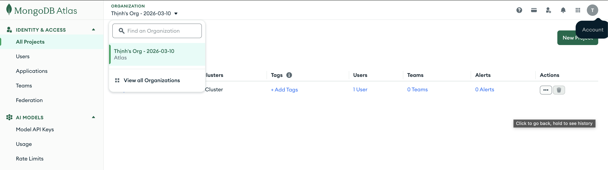

### 1.2 Tìm nạp dữ liệu mẫu trên MongoDB Atlas vào cluster

**Thực hiện:**

- Dùng chức năng nạp sample dataset trong Atlas.

**Kết quả:**

- Cluster có sẵn các sample database/collection để kiểm tra kết nối.

**Ảnh minh họa:**

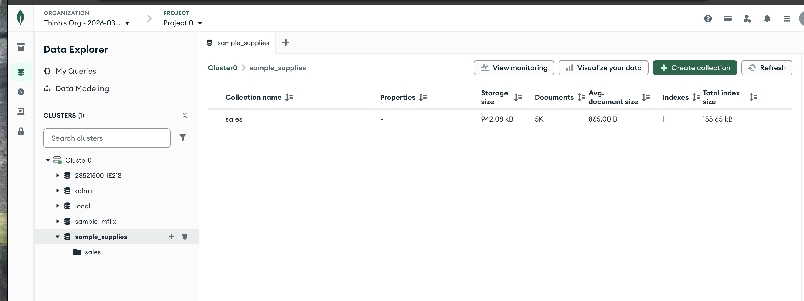

### 1.3 Cài đặt MongoDB Compass trên máy tính

**Thực hiện:**

- Tải và cài đặt MongoDB Compass phiên bản phù hợp hệ điều hành.

**Kết quả:**

- MongoDB Compass cài đặt thành công và mở được ứng dụng.

**Ảnh minh họa:**

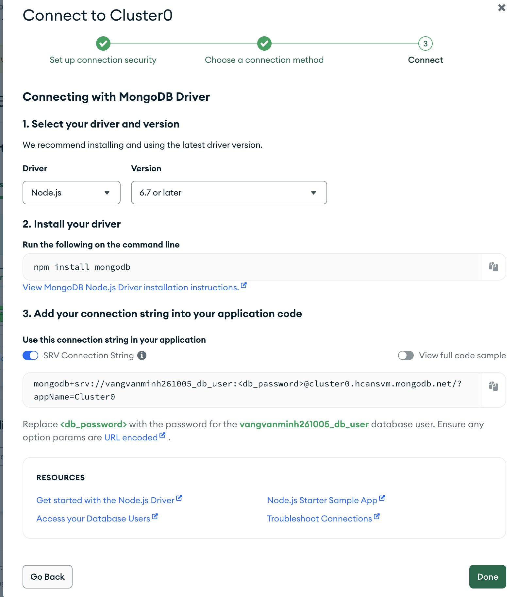
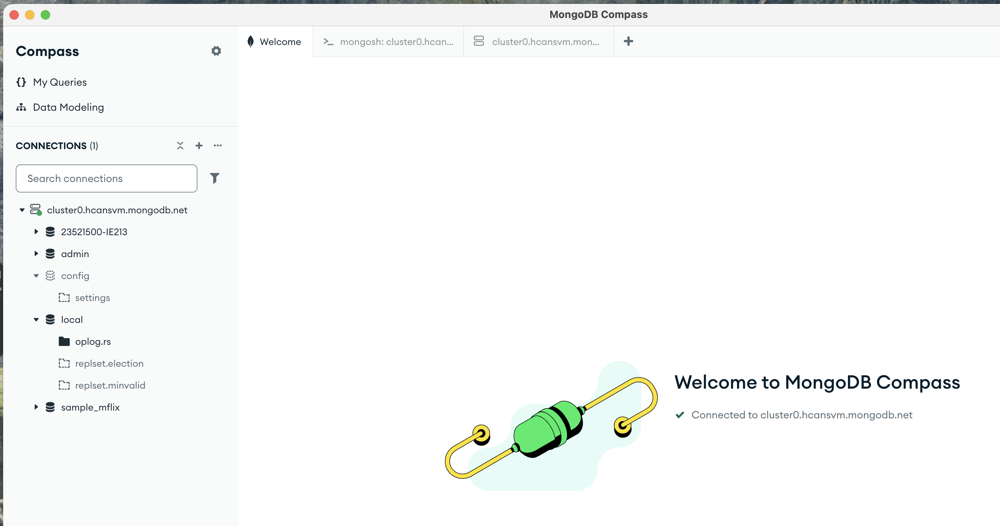

### 1.4 Kết nối MongoDB Compass với cluster đã tạo trên MongoDB Atlas

**Thực hiện:**

- Lấy connection string từ Atlas.
- Cấu hình network access/IP và database user (0.0.0.0/0).
- Dán connection string vào Compass để kết nối.

**Kết quả:**

- Compass kết nối thành công đến cluster Atlas.

**Ảnh minh họa:**

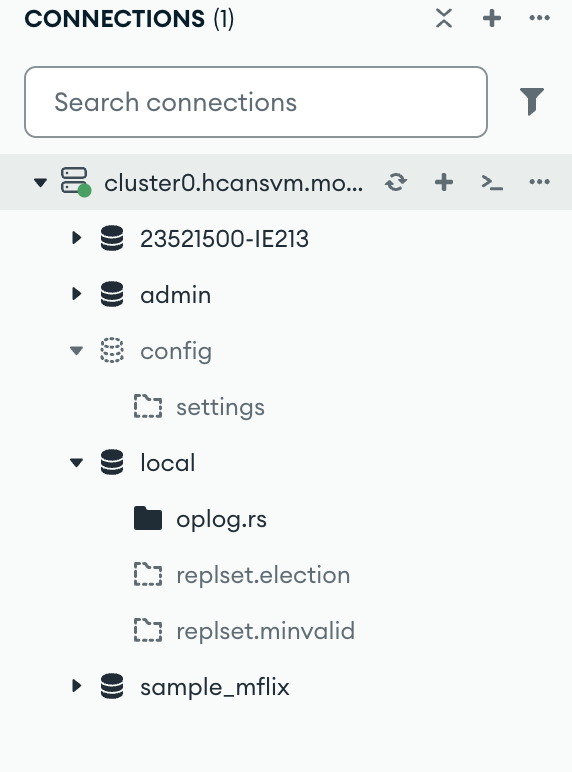

## Bài 2

**Lưu ý đề bài:** Không thêm dữ liệu bằng giao diện; thao tác bằng `mongosh` trong Compass hoặc Mongo Shell.

### 2.1 Tạo cơ sở dữ liệu tên MSSV-IE213 trên cluster

**Lệnh thực hiện:**

```javascript
use 23521500-IE213
db.createCollection("employees")
```

**Kết quả:**

- Tạo thành công database `23521500-IE213` và collection `employees`.

**Ảnh minh họa:**

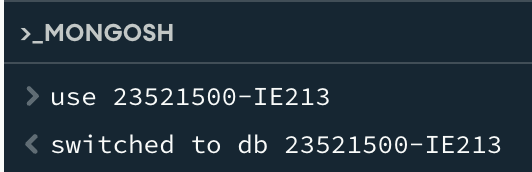

### 2.2 Thêm các document ban đầu vào `employees`

**Lệnh thực hiện:**

```javascript
db.employees.insertMany([
  { id: 1, name: { first: "John", last: "Doe" }, age: 48 },
  { id: 2, name: { first: "Jane", last: "Doe" }, age: 16 },
  { id: 3, name: { first: "Alice", last: "A" }, age: 32 },
  { id: 4, name: { first: "Bob", last: "B" }, age: 64 },
]);
```

**Kết quả:**

- Thêm thành công 4 document theo đề bài.

**Ảnh minh họa:**

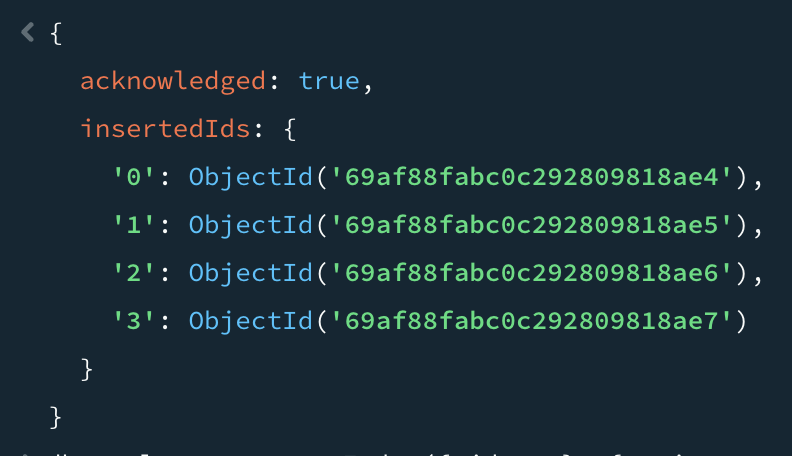

### 2.3 Biến trường `id` thành duy nhất

**Lệnh thực hiện:**

```javascript
db.employees.createIndex({ id: 1 }, { unique: true });
```

**Kết quả:**

- Trường `id` có ràng buộc unique, không thể insert trùng.

**Ảnh minh họa:**

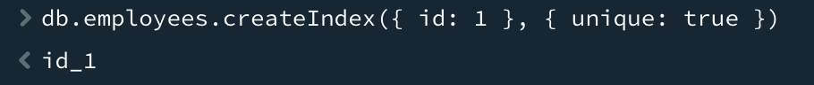

### 2.4 Tìm document có firstname là John và lastname là Doe

**Lệnh thực hiện:**

```javascript
db.employees.find({ "name.first": "John", "name.last": "Doe" });
```

**Kết quả:**

- Trả về đúng document của John Doe.

**Ảnh minh họa:**

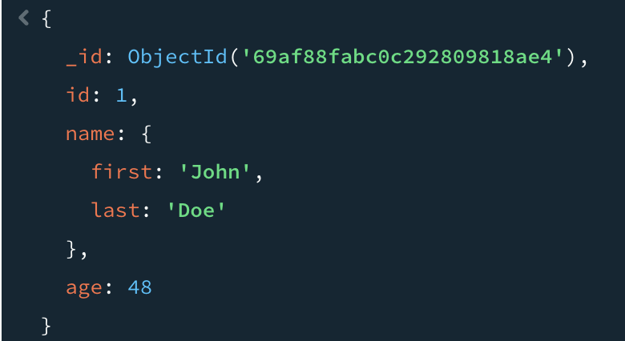

### 2.5 Tìm những người có tuổi trên 30 và dưới 60

**Lệnh thực hiện:**

```javascript
db.employees.find({ age: { $gt: 30, $lt: 60 } });
```

**Kết quả:**

- Trả về đúng danh sách nhân viên thỏa điều kiện tuổi.

**Ảnh minh họa:**

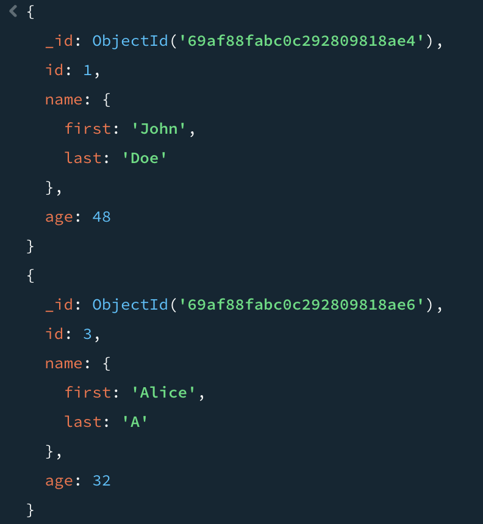

### 2.6 Thêm 2 document có `middle name`, sau đó tìm tất cả document có `middle name`

**Lệnh thực hiện:**

```javascript
db.employees.insertMany([
  { id: 5, name: { first: "Rooney", middle: "K", last: "A" }, age: 30 },
  { id: 6, name: { first: "Ronaldo", middle: "T", last: "B" }, age: 60 },
]);

db.employees.find({ "name.middle": { $exists: true } });
```

**Kết quả:**

- Thêm thành công 2 document mới.
- Truy vấn trả về đúng các document có `middle name`.

**Ảnh minh họa:**

<!-- insert -->

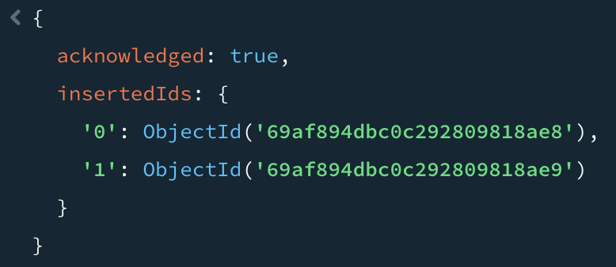

<!-- tim middle name -->

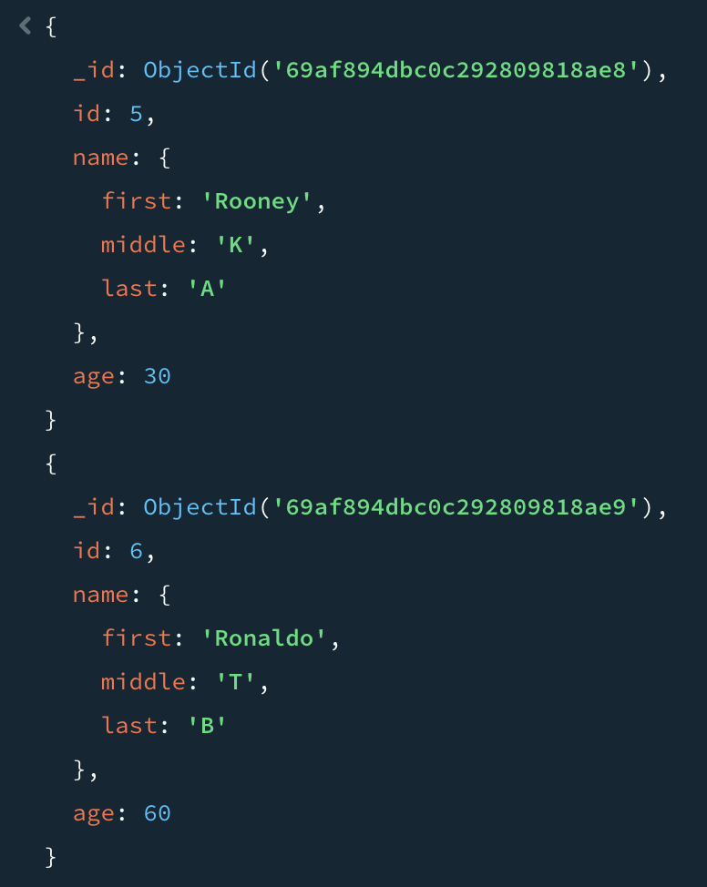

### 2.7 Xóa `middle name` khỏi các document có trường này

**Lệnh thực hiện:**

```javascript
db.employees.updateMany(
  { "name.middle": { $exists: true } },
  { $unset: { "name.middle": "" } },
);
```

**Kết quả:**

- Các document không còn trường `name.middle`.

**Ảnh minh họa:**

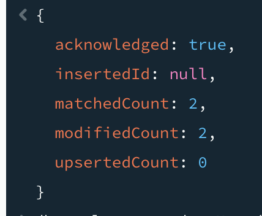

### 2.8 Thêm trường `organization: "UIT"` vào tất cả document

**Lệnh thực hiện:**

```javascript
db.employees.updateMany({}, { $set: { organization: "UIT" } });
```

**Kết quả:**

- Tất cả document có thêm trường `organization = UIT`.

**Ảnh minh họa:**

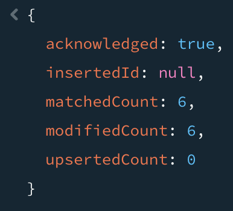

### 2.9 Điều chỉnh `organization` của nhân viên có id 5 và 6 thành `USSH`

**Lệnh thực hiện:**

```javascript
db.employees.updateMany(
  { id: { $in: [5, 6] } },
  { $set: { organization: "USSH" } },
);
```

**Kết quả:**

- Nhân viên có `id = 5, 6` được cập nhật `organization = USSH`.

**Ảnh minh họa:**

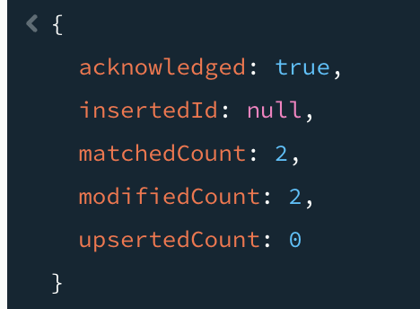

### 2.10 Tính tổng tuổi và tuổi trung bình của nhân viên thuộc UIT và USSH

**Lệnh thực hiện:**

```javascript
db.employees.aggregate([
  { $match: { organization: { $in: ["UIT", "USSH"] } } },
  {
    $group: {
      _id: "$organization",
      totalAge: { $sum: "$age" },
      avgAge: { $avg: "$age" },
      count: { $sum: 1 },
    },
  },
]);
```

**Kết quả:**

- Trả về thống kê `totalAge`, `avgAge`, `count` theo từng organization.

**Ảnh minh họa:**

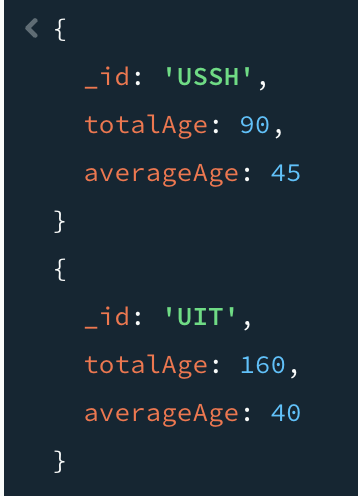

## 7. Kết quả thực hiện tổng quan

- Đã thực hiện xong toàn bộ yêu cầu của Lab01.
- Tất cả thao tác được chạy bằng **`mongosh` trong MongoDB Compass**.
