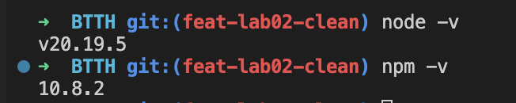
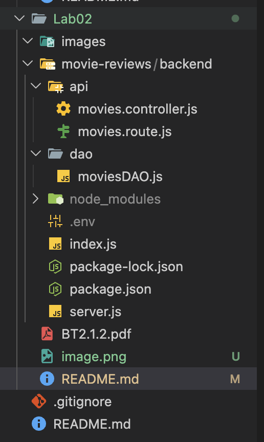
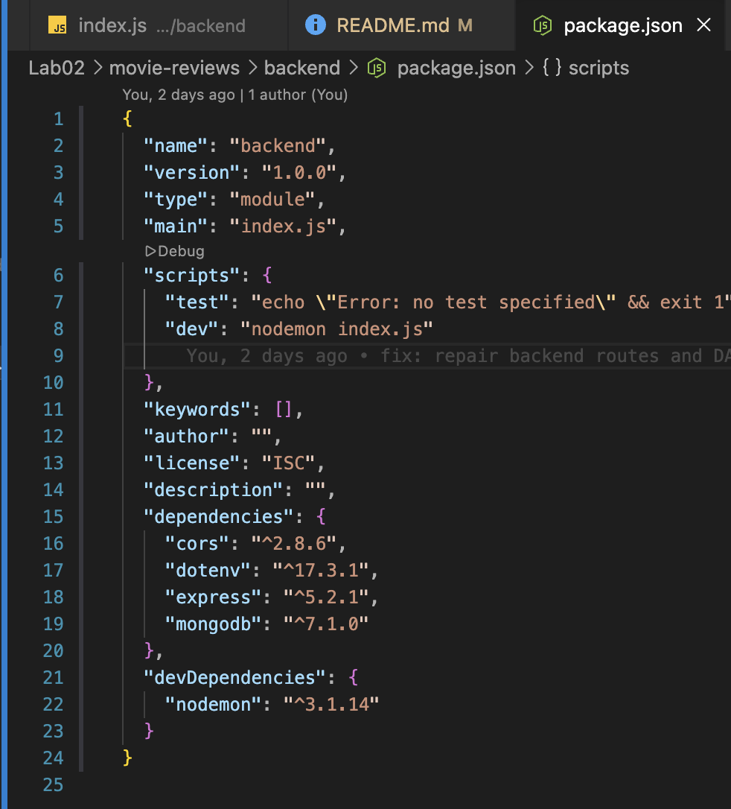
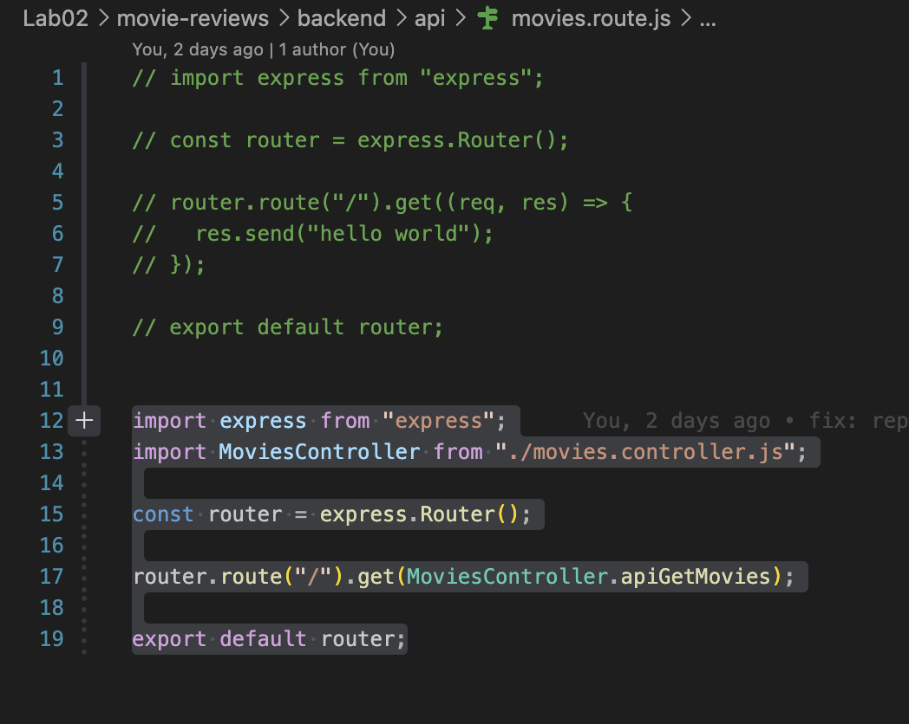
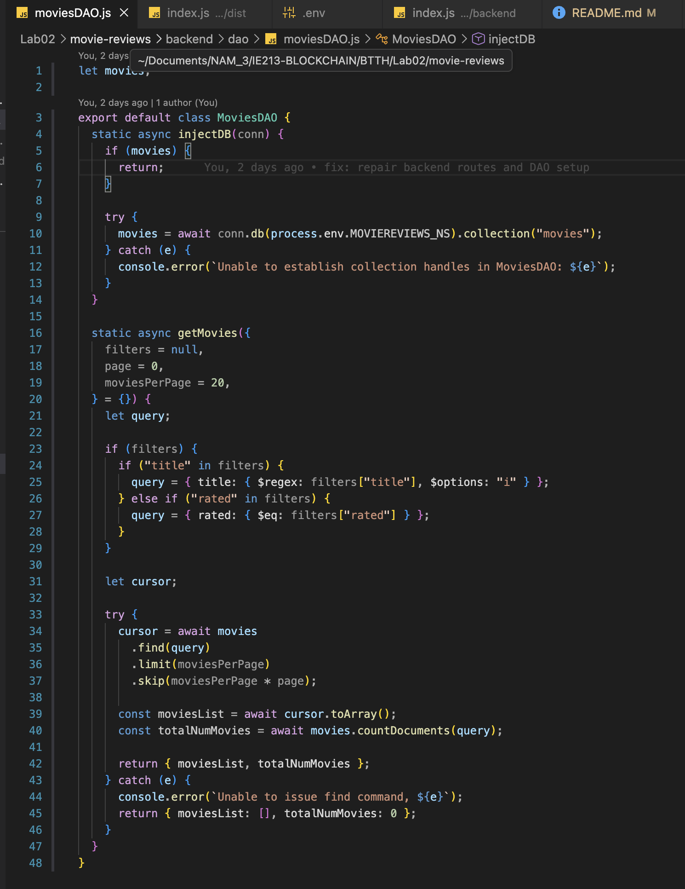
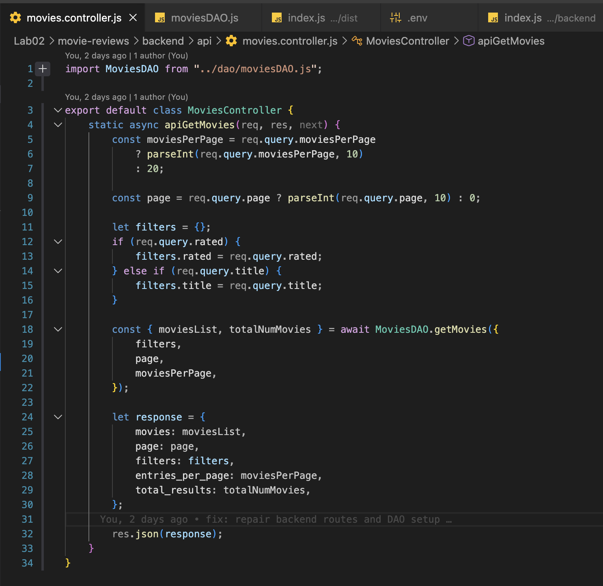
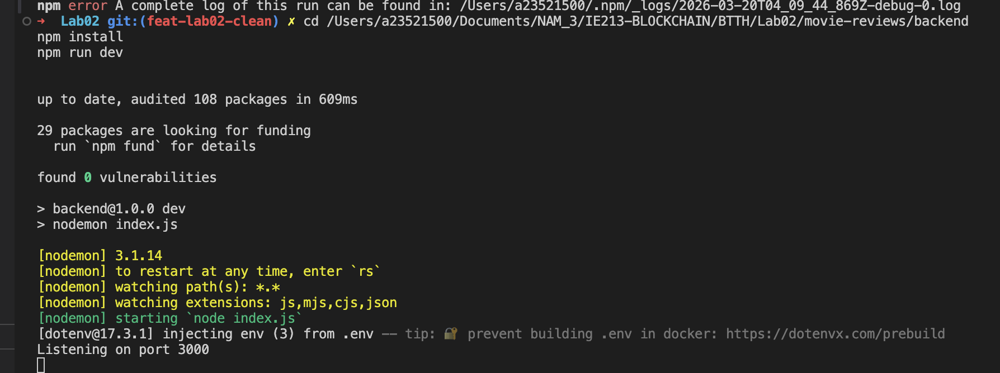
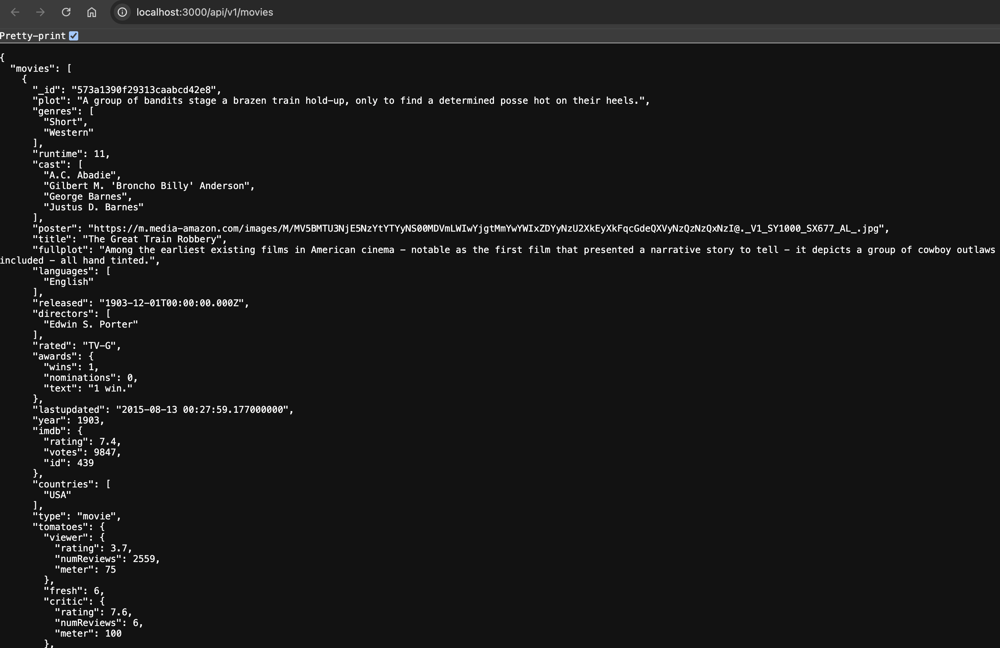

# Lab02 (Thiết lập Backend với NodeJS/ExpressJS)

## 1. Thông tin sinh viên

| Họ tên            | MSSV         | Lớp           |
| :---------------- | :----------- | :------------ |
| **Ngô Văn Thịnh** | **23521500** | **IE213.Q21** |

## 2. Thông tin môn học

- Môn học: **IE213.Q21 - Kỹ thuật phát triển hệ thống web**

## 3. Danh sách lab

- **Lab02: Thiết lập Backend với NodeJS/ExpressJS**

## 4. Mô tả ngắn gọn Lab02

Lab02 thực hành xây dựng backend cơ bản cho ứng dụng Movie Reviews bằng **NodeJS + ExpressJS + MongoDB Atlas** theo mô hình route/controller/dao.

## 5. Cách chạy chương trình

1. Di chuyển vào thư mục backend:

```bash
cd Lab02/movie-reviews/backend
```

2. Cài dependency:

```bash
npm install
```

3. Tạo file `.env` (nếu chưa có):

```env
MOVIEREVIEWS_DB_URI=<mongodb-atlas-uri>
MOVIEREVIEWS_NS=sample_mflix
PORT=3000
```

4. Chạy server ở chế độ dev:

```bash
npm run dev
```

5. Mở trình duyệt:

- `http://localhost:3000/api/v1/movies`

## 6. Chi tiết thực hiện theo từng câu

## Bài 1: Thiết lập môi trường

### 1.1 Tải và cài đặt NodeJS

**Thực hiện:**

- Cài NodeJS từ `nodejs.org`.
- Kiểm tra phiên bản bằng lệnh:

```bash
node -v
npm -v
```

**Kết quả:**

- Máy đã cài thành công NodeJS và npm.

**Ảnh minh họa:**



### 1.2 Cài công cụ soạn thảo mã nguồn

**Thực hiện:**

- Sử dụng Visual Studio Code để viết mã.

**Kết quả:**

- Mở được thư mục lab và chỉnh sửa source code.


### 1.3 Khởi tạo cây thư mục dự án

**Thực hiện:**

- Tạo cấu trúc thư mục `movie-reviews/backend`.

**Kết quả:**

- Có thư mục backend chứa source code server.

**Ảnh minh họa:**



### 1.4 Khởi tạo dự án với npm init

**Thực hiện:**

```bash
npm init -y
```

**Kết quả:**

- Sinh ra file `package.json` cho backend.

**Ảnh minh họa:**



### 1.5 Cài dependency mongodb, express, cors, dotenv

**Thực hiện:**

```bash
npm install mongodb express cors dotenv
```

**Kết quả:**

- Các thư viện backend đã được thêm vào phần `dependencies`.


### 1.6 Cài nodemon

**Thực hiện:**

```bash
npm install --save-dev nodemon
```

**Kết quả:**

- Chạy server bằng `npm run dev` và tự restart khi đổi code.

## Bài 2

### 2.1 Tạo tệp `server.js` để khởi tạo web server

**Thực hiện:**

- Import `express`, `cors` và router movies.
- Cấu hình middleware JSON/CORS.
- Định tuyến `/api/v1/movies`.
- Xử lý route không tồn tại bằng lỗi 404.

**Mã chính:**

```javascript
app.use("/api/v1/movies", movies);
app.use((req, res) => {
  res.status(404).json({ error: "not found" });
});
```

**Kết quả:**

- Server có routing cơ bản và trả lỗi đúng cho endpoint không hợp lệ.

### 2.2 Tạo file `.env` cho biến môi trường

**Thực hiện:**

- Tạo file `.env` trong thư mục backend.
- Khai báo URI MongoDB Atlas, namespace DB và PORT.

**Mẫu cấu hình:**

```env
MOVIEREVIEWS_DB_URI=<mongodb-atlas-uri>
MOVIEREVIEWS_NS=sample_mflix
PORT=3000
```

**Kết quả:**

- Thông số cấu hình được tách khỏi source code.


### 2.3 Tạo `index.js` để kết nối DB và chạy server

**Thực hiện:**

- Nạp biến môi trường bằng `dotenv.config()`.
- Kết nối MongoDB Atlas qua `MongoClient.connect()`.
- Gọi `MoviesDAO.injectDB(client)` trước khi `app.listen(port)`.

**Kết quả:**

- Server chỉ chạy sau khi kết nối DB thành công.

### 2.4 Tạo `api/movies.route.js` để xử lý định tuyến movies

**Thực hiện:**

- Tạo router bằng `express.Router()`.
- Định tuyến `GET /` gọi `MoviesController.apiGetMovies`.

**Mã chính:**

```javascript
router.route("/").get(MoviesController.apiGetMovies);
```

**Kết quả:**

- Endpoint `GET /api/v1/movies` được nối tới controller.

**Ảnh minh họa:**



### 2.5 Thiết lập DAO trong `dao/moviesDAO.js`

**Thực hiện:**

- Tạo class `MoviesDAO` với 2 hàm chính:
- `injectDB(conn)`: trỏ tới collection `movies` trong DB.
- `getMovies({ filters, page, moviesPerPage })`: trả về `moviesList` và `totalNumMovies`.

**Kết quả:**

- Tầng truy xuất dữ liệu hoạt động đúng theo phân trang và filter (`title`, `rated`).

**Ảnh minh họa:**


### 2.6 Thiết lập Controller trong `api/movies.controller.js`

**Thực hiện:**

- Tạo class `MoviesController`.
- Viết hàm `apiGetMovies()` để nhận query từ request.
- Gọi `MoviesDAO.getMovies()` và trả JSON response cho client.

**Kết quả:**

- Controller làm lớp trung gian giữa route và DAO.

**Ảnh minh họa:**


### 2.7 Đưa controller vào route và kiểm tra endpoint

**Thực hiện:**

- Chạy backend bằng `npm run dev`.
- Gửi request tới `http://localhost:3000/api/v1/movies`.
- Quan sát JSON trả về gồm các trường `movies`, `page`, `entries_per_page`, `total_results`.

**Kết quả:**

- Endpoint hoạt động đúng, trả dữ liệu movie từ DB.

**Ảnh minh họa:**




## 7. Kết quả thực hiện tổng quan

- Hoàn thành các yêu cầu thiết lập backend ở Lab02.
- Đã tổ chức mã theo mô hình `route -> controller -> dao`.
- Kết nối được MongoDB Atlas và trả dữ liệu movie qua API.
