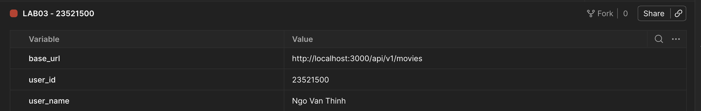
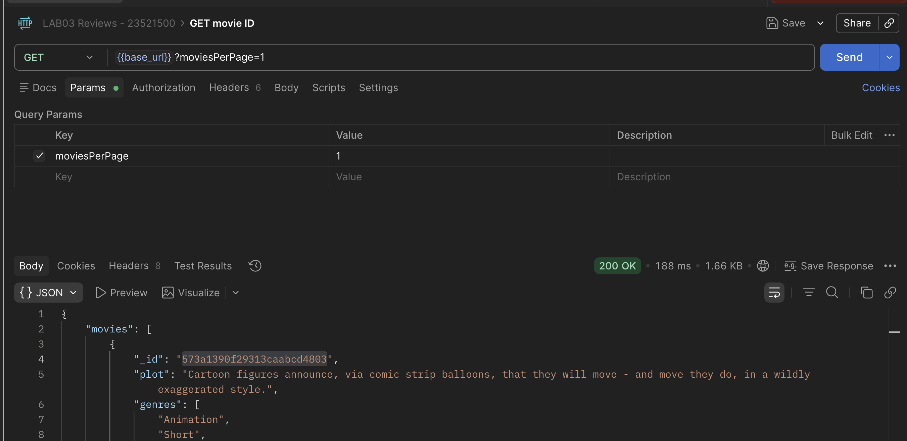
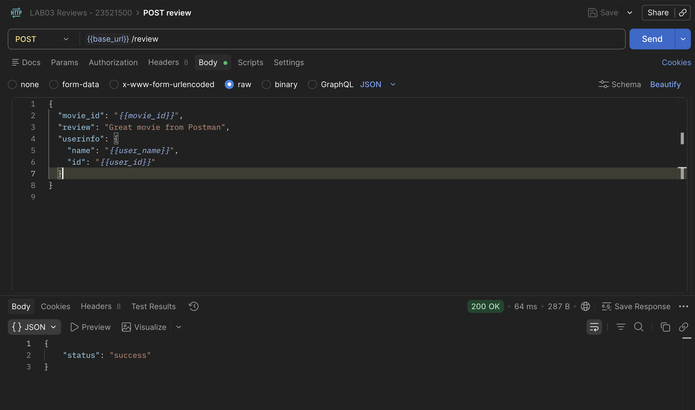
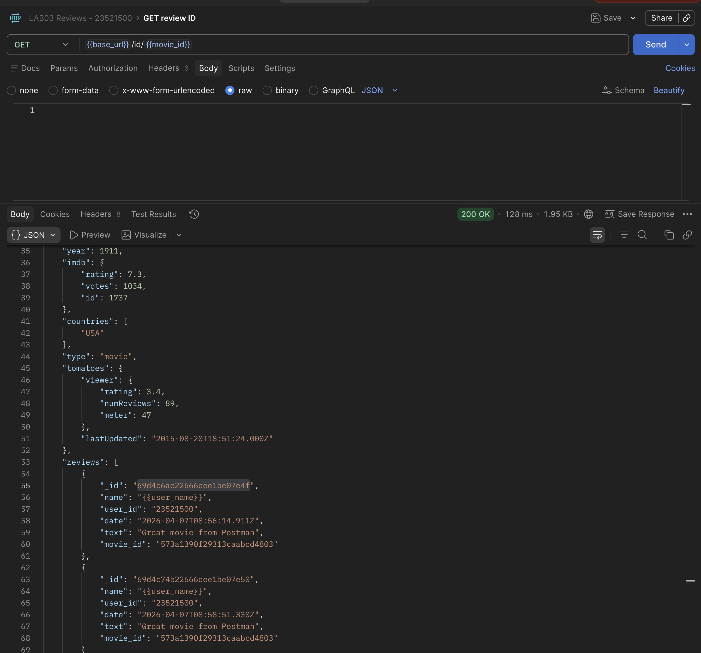
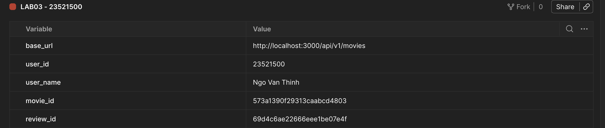
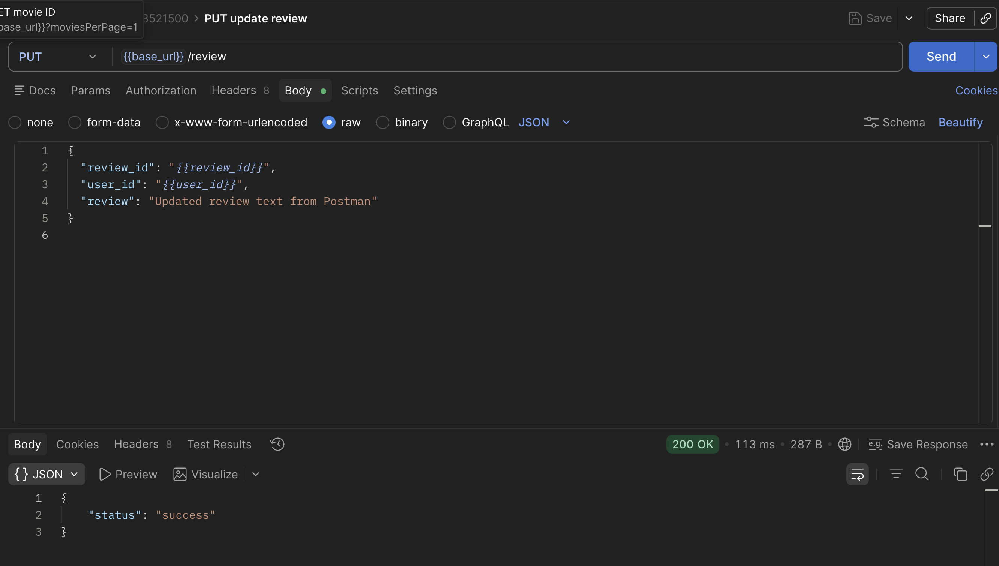
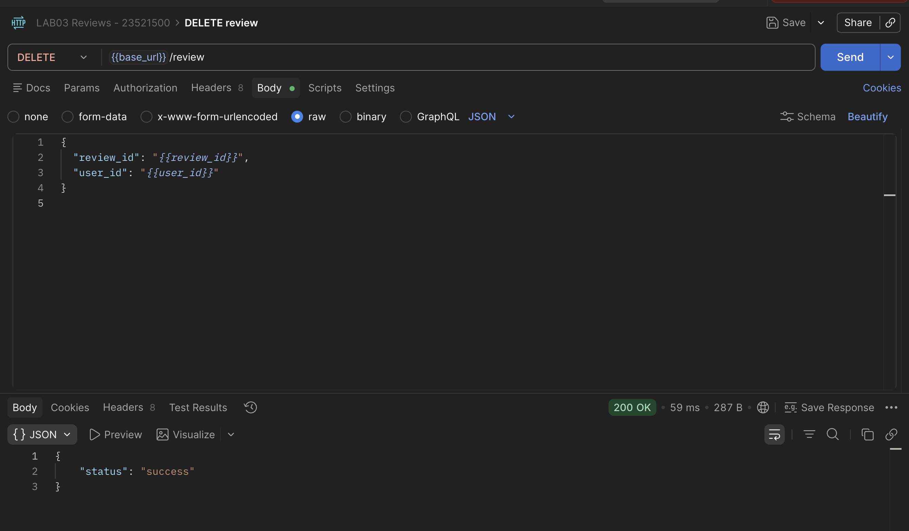
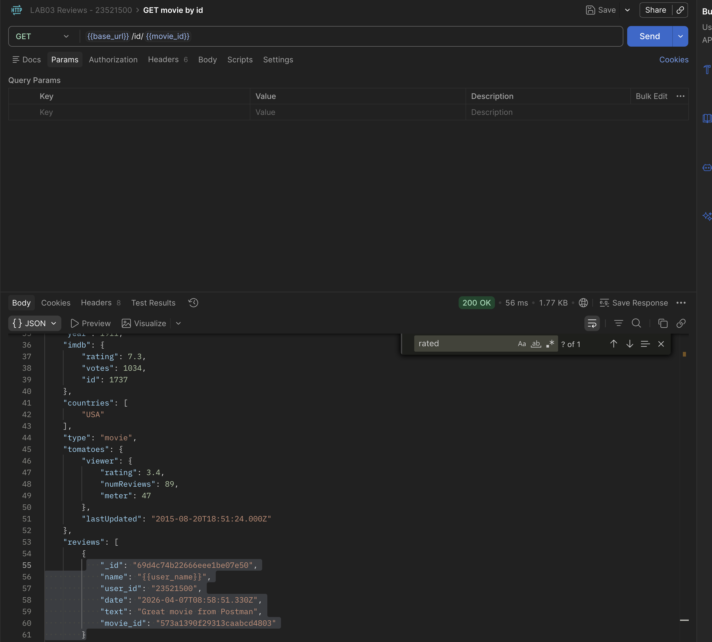
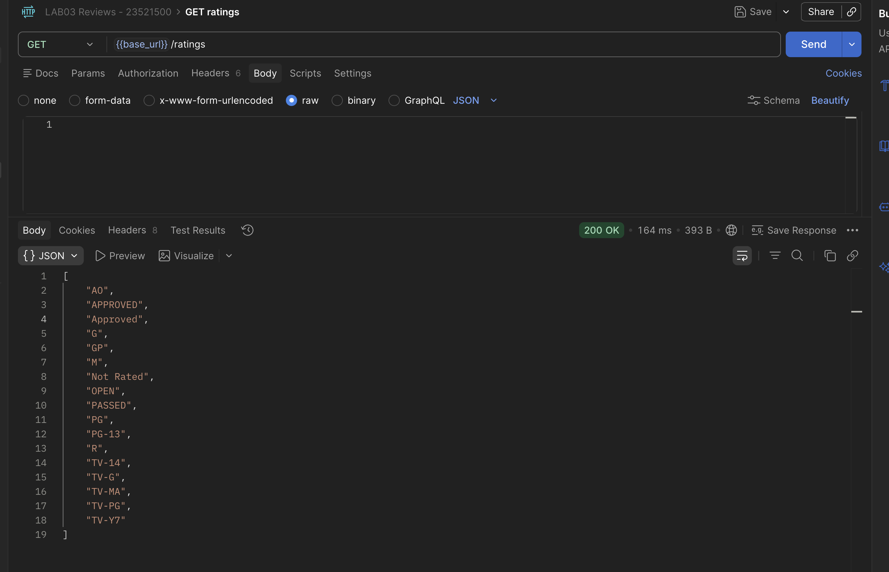

# Lab03 (Hoàn thiện Back-end cho ứng dụng Movie Reviews)

## 1. Thông tin sinh viên

| Họ tên            | MSSV         | Lớp           |
| :---------------- | :----------- | :------------ |
| **Ngô Văn Thịnh** | **23521500** | **IE213.Q21** |

## 2. Thông tin môn học

- Môn học: **IE213.Q21 - Kỹ thuật phát triển hệ thống web**

## 3. Danh sách lab

- **Lab03: Hoàn thiện back-end cho ứng dụng minh họa Movie Reviews**

## 4. Mô tả ngắn gọn Lab03

Lab03 mở rộng trực tiếp từ Lab02 để hoàn thiện backend Movie Reviews theo mô hình `route -> controller -> dao`, tập trung vào:
- CRUD review (`POST/PUT/DELETE`).
- Lấy chi tiết phim theo id kèm review.
- Lấy danh sách rating hiện có trong dữ liệu.

## 5. Cách chạy chương trình

1. Di chuyển vào thư mục backend của Lab03:

```bash
cd Lab03/movie-reviews/backend
```

2. Cài dependency:

```bash
npm install
```

3. Tạo file `.env` (nếu chưa có):

```env
MOVIEREVIEWS_DB_URI=<mongodb-atlas-uri>
MOVIEREVIEWS_NS=sample_mflix
PORT=3000
```

4. Chạy server ở chế độ dev:

```bash
npm run dev
```

5. Kiểm tra nhanh API:

- `http://localhost:3000/api/v1/movies`
- `http://localhost:3000/api/v1/movies/ratings`
- `http://localhost:3000/api/v1/movies/id/<movie_id>`

## 6. Chi tiết thực hiện theo từng bài

## Bài 1: Thiết lập định tuyến cho review

### 1.1 Định tuyến `/review`

**Thực hiện:**

- Trong `api/movies.route.js`, thêm route `/review` dưới prefix `/api/v1/movies`.

**Kết quả:**

- Đường dẫn đầy đủ: `localhost:3000/api/v1/movies/review`.

**Mã chính:**

```javascript
router
  .route("/review")
  .post(ReviewsController.apiPostReview)
  .put(ReviewsController.apiUpdateReview)
  .delete(ReviewsController.apiDeleteReview);
```

### 1.2 Thêm review bằng `POST`

**Thực hiện:**

- Ánh xạ `POST /review` tới `ReviewsController.apiPostReview`.

**Kết quả:**

- Hệ thống nhận yêu cầu thêm review từ client.

### 1.3 Cập nhật review bằng `PUT`

**Thực hiện:**

- Ánh xạ `PUT /review` tới `ReviewsController.apiUpdateReview`.

**Kết quả:**

- Hệ thống nhận yêu cầu sửa review từ client.

### 1.4 Xóa review bằng `DELETE`

**Thực hiện:**

- Ánh xạ `DELETE /review` tới `ReviewsController.apiDeleteReview`.

**Kết quả:**

- Hệ thống nhận yêu cầu xóa review từ client.

## Bài 2: Thiết lập Controller cho review

### 2.1 Tạo tệp `reviews.controller.js`

**Thực hiện:**

- Tạo class `ReviewsController` trong thư mục `api`.

**Kết quả:**

- Có controller chuyên xử lý yêu cầu review.

**Mã chính:**

```javascript
import ReviewsDAO from "../dao/reviewsDAO.js";

export default class ReviewsController {
  // apiPostReview, apiUpdateReview, apiDeleteReview
}
```

### 2.2 Import DAO

**Thực hiện:**

- Import `ReviewsDAO` từ `dao/reviewsDAO.js`.

**Kết quả:**

- Controller gọi được tầng truy xuất dữ liệu.

### 2.3 Tạo `apiPostReview()`

**Thực hiện:**

- Nhận dữ liệu từ `req.body`: `movie_id`, `review`, `userinfo.name`, `userinfo.id`.
- Tạo `date = new Date()`.
- Gọi `ReviewsDAO.addReview(...)`.
- Trả về JSON `{ status: "success" }` nếu thành công.

**Kết quả:**

- Thêm review mới vào collection `reviews`.

**Mã chính:**

```javascript
const movieId = req.body.movie_id;
const review = req.body.review || req.body.text;
const userInfo = req.body.userinfo || {};
const userId = userInfo.id || req.body.user_id;
const name = userInfo.name || req.body.name;
const date = new Date();

const reviewResponse = await ReviewsDAO.addReview(
  movieId,
  userId,
  name,
  review,
  date,
);
res.json({ status: "success" });
```

### 2.4 Tạo `apiUpdateReview()`

**Thực hiện:**

- Nhận `review_id`, `user_id`, `review` từ `req.body`.
- Tạo `date = new Date()`.
- Gọi `ReviewsDAO.updateReview(...)`.
- Dựa vào `modifiedCount` để xác định update thành công.

**Kết quả:**

- Chỉ user tạo review mới được phép cập nhật review đó.

**Mã chính:**

```javascript
const reviewResponse = await ReviewsDAO.updateReview(
  reviewId,
  userId,
  review,
  date,
);

if (reviewResponse.modifiedCount === 0) {
  throw new Error("Unable to update review - user may not be original poster");
}
res.json({ status: "success" });
```

### 2.5 Tạo `apiDeleteReview()`

**Thực hiện:**

- Nhận `review_id`, `user_id` từ `req.body`.
- Gọi `ReviewsDAO.deleteReview(...)`.
- Dựa vào `deletedCount` để xác định xóa thành công.

**Kết quả:**

- Chỉ user tạo review mới được phép xóa review đó.

**Mã chính:**

```javascript
const reviewResponse = await ReviewsDAO.deleteReview(reviewId, userId);

if (reviewResponse.deletedCount === 0) {
  throw new Error("Unable to delete review - user may not be original poster");
}
res.json({ status: "success" });
```

## Bài 3: Thiết lập DAO cho reviews

### 3.1 Tạo `dao/reviewsDAO.js`

**Thực hiện:**

- Import `mongodb`, tạo `ObjectId`.
- Tạo biến `reviews` tham chiếu tới collection `reviews`.

**Kết quả:**

- Có tầng DAO cho nghiệp vụ review.

**Mã chính:**

```javascript
import mongodb from "mongodb";

const ObjectId = mongodb.ObjectId;
let reviews;
```

### 3.2 Tạo `injectDB()`

**Thực hiện:**

- Kết nối tới collection `reviews` qua `conn.db(...).collection("reviews")`.
- Gọi `ReviewsDAO.injectDB(client)` trong `index.js` sau khi connect DB.

**Kết quả:**

- Backend sẵn sàng thao tác với collection `reviews`.

**Mã chính:**

```javascript
// dao/reviewsDAO.js
static async injectDB(conn) {
  if (reviews) return;
  reviews = await conn.db(process.env.MOVIEREVIEWS_NS).collection("reviews");
}
```

```javascript
// index.js
await MoviesDAO.injectDB(client);
await ReviewsDAO.injectDB(client);
```

### 3.3 Tạo `addReview()`

**Thực hiện:**

- Dùng `insertOne`.
- Chuyển `movieId` từ string sang `ObjectId`.

**Kết quả:**

- Lưu được review mới liên kết đúng với phim.

**Mã chính:**

```javascript
const reviewDoc = {
  name: name,
  user_id: userId,
  date: date,
  text: review,
  movie_id: new ObjectId(movieId),
};
return await reviews.insertOne(reviewDoc);
```

### 3.4 Tạo `updateReview()`

**Thực hiện:**

- Dùng `updateOne`.
- Chuyển `reviewId` sang `ObjectId`.
- Điều kiện update gồm cả `_id` và `user_id`.

**Kết quả:**

- Đảm bảo đúng user mới sửa được review.

**Mã chính:**

```javascript
return await reviews.updateOne(
  { user_id: userId, _id: new ObjectId(reviewId) },
  { $set: { text: review, date: date } },
);
```

### 3.5 Tạo `deleteReview()`

**Thực hiện:**

- Dùng `deleteOne`.
- Chuyển `reviewId` sang `ObjectId`.
- Điều kiện xóa gồm cả `_id` và `user_id`.

**Kết quả:**

- Đảm bảo đúng user mới xóa được review.

**Mã chính:**

```javascript
return await reviews.deleteOne({
  _id: new ObjectId(reviewId),
  user_id: userId,
});
```

### 3.6 Thử nghiệm API review

**Thực hiện (Postman):**

1. Tạo Environment:
- `base_url = http://localhost:3000/api/v1/movies`
- `user_id = 23521500`
- `user_name = Ngo Van Thinh`
- `movie_id` và `review_id` sẽ cập nhật sau.



2. Lấy `movie_id`:
- Gửi `GET {{base_url}}?moviesPerPage=1`.
- Copy `movies[0]._id` và gán vào biến `movie_id`.



3. Test `POST /review`:
- URL: `{{base_url}}/review`
- Body (raw JSON):

```json
{
  "movie_id": "{{movie_id}}",
  "review": "Great movie from Postman",
  "userinfo": {
    "name": "{{user_name}}",
    "id": "{{user_id}}"
  }
}
```


4. Lấy `review_id`:
- Gửi `GET {{base_url}}/id/{{movie_id}}`.
- Tìm review vừa tạo, copy `_id` và gán vào biến `review_id`.



**Movie id và review id:**


5. Test `PUT /review`:
- URL: `{{base_url}}/review`
- Body (raw JSON):

```json
{
  "review_id": "{{review_id}}",
  "user_id": "{{user_id}}",
  "review": "Updated review text from Postman"
}
```



6. Test `DELETE /review`:
- URL: `{{base_url}}/review`
- Body (raw JSON):

```json
{
  "review_id": "{{review_id}}",
  "user_id": "{{user_id}}"
}
```


**Kết quả mong đợi:**

- Cả 3 request `POST`, `PUT`, `DELETE` trả `200` và body `{ "status": "success" }`.

**Link kiểm tra nhanh API:**

- `http://localhost:3000/api/v1/movies/review` (POST/PUT/DELETE)


## Bài 4: Hoàn thiện back-end cho ứng dụng minh họa

### 4.1 Thêm 2 định tuyến mới cho movies

**Thực hiện:**

- `GET /api/v1/movies/id/:id`: lấy thông tin phim + các review liên quan.
- `GET /api/v1/movies/ratings`: lấy danh sách tất cả loại rating.

**Kết quả:**

- Hoàn chỉnh nhóm API đọc dữ liệu nâng cao cho movie.

**Mã chính:**

```javascript
router.route("/id/:id").get(MoviesController.apiGetMovieById);
router.route("/ratings").get(MoviesController.apiGetRatings);
```

### 4.2 Thêm 2 phương thức controller trong `movies.controller.js`

**Thực hiện:**

- `apiGetMovieById()`.
- `apiGetRatings()`.

**Kết quả:**

- Controller xử lý đúng 2 route mới.

**Mã chính:**

```javascript
static async apiGetMovieById(req, res, next) {
  const movieId = req.params.id || {};
  const movie = await MoviesDAO.getMovieById(movieId);
  if (!movie) return res.status(404).json({ error: "Movie not found" });
  res.json(movie);
}

static async apiGetRatings(req, res, next) {
  const ratings = await MoviesDAO.getRatings();
  res.json(ratings);
}
```

### 4.3 Thêm 2 phương thức DAO trong `moviesDAO.js`

**Thực hiện:**

- `getMovieById(id)`: dùng `aggregate()` với `$match` và `$lookup` để join với `reviews`.
- `getRatings()`: dùng `distinct("rated")`.

**Kết quả:**

- Trả được dữ liệu tổng hợp phim + review và danh sách rating.

**Mã chính:**

```javascript
static async getMovieById(id) {
  const pipeline = [
    { $match: { _id: new ObjectId(id) } },
    {
      $lookup: {
        from: "reviews",
        localField: "_id",
        foreignField: "movie_id",
        as: "reviews",
      },
    },
  ];
  return await movies.aggregate(pipeline).next();
}

static async getRatings() {
  return await movies.distinct("rated");
}
```

### 4.4 Thử nghiệm các API mới

**Thực hiện (Postman):**

1. Test `GET /ratings`:
- Method: `GET`
- URL: `http://localhost:3000/api/v1/movies/ratings`
- Body: **không cần truyền JSON** (để trống).
- Kết quả mong đợi: status `200`, response là mảng ratings.

2. Lấy `movie_id` để test API chi tiết phim:
- Gửi `GET http://localhost:3000/api/v1/movies?moviesPerPage=1`
- Copy `movies[0]._id`.

3. Test `GET /id/:id`:
- Method: `GET`
- URL: `http://localhost:3000/api/v1/movies/id/<movie_id>`
- Body: **không cần truyền JSON** (để trống).
- Kết quả mong đợi: status `200`, response có thông tin phim và mảng `reviews`.


**Link kiểm tra nhanh API:**

- `http://localhost:3000/api/v1/movies/ratings`
- `http://localhost:3000/api/v1/movies/id/<movie_id>`

**Ảnh minh họa:**





## 7. Kết quả thực hiện tổng quan

- Hoàn thành mở rộng backend từ Lab02 sang Lab03 trong thư mục riêng `Lab03/movie-reviews`.
- Đã triển khai đầy đủ CRUD review theo yêu cầu đề.
- Đã triển khai API lấy movie theo id (kèm review) và API lấy ratings.
- Kiến trúc vẫn nhất quán theo mô hình `route -> controller -> dao`.
