# Lab04 (Thiết lập Frontend với ReactJS)

## 1. Thông tin sinh viên

| Họ tên            | MSSV         | Lớp           |
| :---------------- | :----------- | :------------ |
| **Ngô Văn Thịnh** | **23521500** | **IE213.Q21** |

## 2. Thông tin môn học

- Môn học: **IE213.Q21 - Kỹ thuật phát triển hệ thống web**

## 3. Danh sách lab

- **Lab04: Thiết lập Frontend với ReactJS**

## 4. Mô tả ngắn gọn Lab04

Lab04 thực hành xây dựng frontend ReactJS cho ứng dụng **Movie Reviews** trong mô hình MERN stack. Phần frontend được kết nối với backend của các lab trước để hiển thị danh sách phim, xem chi tiết phim, thêm/sửa/xóa review và mô phỏng trạng thái đăng nhập của người dùng.

## 5. Cách chạy chương trình

1. Mở terminal thứ nhất và chạy backend:

```bash
cd Lab04/movie-reviews/backend
npm install
cp .env.example .env
```

2. Cấu hình file `.env`:

```env
MOVIEREVIEWS_DB_URI=<mongodb-atlas-uri>
MOVIEREVIEWS_NS=sample_mflix
PORT=3000
```

3. Chạy backend:

```bash
npm run dev
```

4. Mở terminal thứ hai và chạy frontend:

```bash
cd Lab04/movie-reviews/frontend
npm install
PORT=3001 npm start
```

5. Mở trình duyệt:

- Frontend: `http://localhost:3001`
- Backend API: `http://localhost:3000/api/v1/movies`

**Lưu ý:**

- Backend dùng cổng `3000`.
- Frontend được cấu hình `proxy` sang `http://localhost:3000`, nên có thể gọi trực tiếp API backend.
- Khi chạy đồng thời backend và frontend, nên để frontend ở cổng `3001` để tránh trùng cổng.

## 6. Chi tiết thực hiện theo từng câu

## Bài 1: Thiết lập nơi làm việc với frontend của dự án

### 1.1 Tạo template frontend ReactJS trong dự án `movie-reviews`

**Thực hiện:**

- Tạo thư mục `Lab04/movie-reviews/frontend`.
- Khởi tạo ứng dụng React để làm giao diện cho hệ thống Movie Reviews.

**Kết quả:**

- Dự án có đầy đủ cấu trúc frontend để chạy độc lập với backend.
- Source code frontend đặt trong `Lab04/movie-reviews/frontend/src`.

**Ảnh minh họa:**

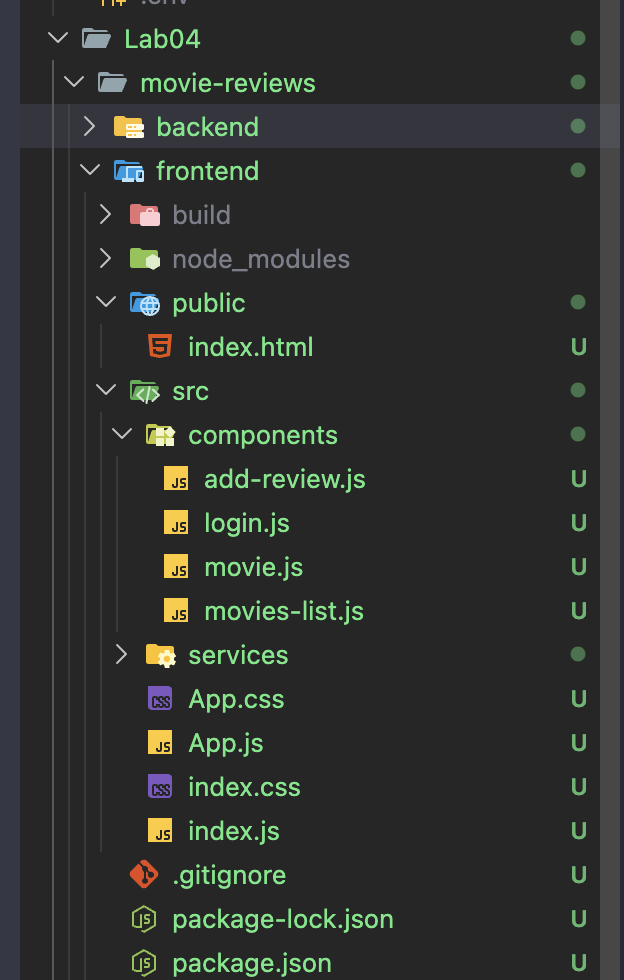

### 1.2 Cài đặt các package hỗ trợ xây dựng dự án

**Thực hiện:**

```bash
npm install bootstrap react-bootstrap react-router-dom
```

**Kết quả:**

- Frontend sử dụng các package chính:
- `bootstrap` và `react-bootstrap` để dựng giao diện.
- `react-router-dom` để thiết lập định tuyến giữa các trang.

**Ảnh minh họa:**

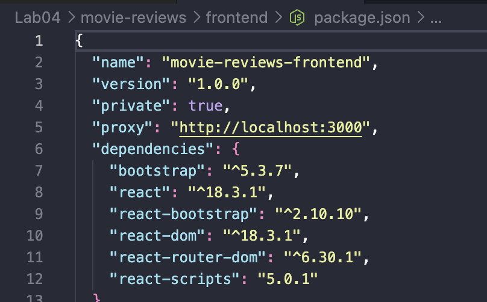

## Bài 2: Xây dựng Navigation Header bar cho ứng dụng

### 2.1 Tạo các component chính cho frontend

**Thực hiện:**

- Tạo các component trong `src/components`:
- `movies-list.js`
- `movie.js`
- `add-review.js`
- `login.js`

**Kết quả:**

- Ứng dụng được tách thành các component đúng yêu cầu lab.
- Mỗi component phụ trách một chức năng riêng của giao diện.

**Ảnh minh họa:**

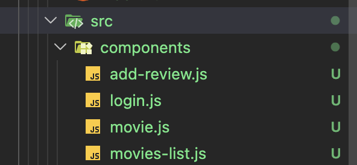

### 2.2 Xây dựng `Navigation Header bar` trong `App.js`

**Thực hiện:**

- Sử dụng `Navbar`, `Nav`, `Container` từ `react-bootstrap`.
- Thiết lập logo `Movie Reviews`.
- Tạo menu điều hướng tới trang danh sách phim.
- Hiển thị trạng thái `Login/Logout` theo state người dùng.

**Mã chính:**

```javascript
<Navbar expand="lg" className="app-navbar" sticky="top">
  <Container>
    <Navbar.Brand as={Link} to="/movies">
      Movie Reviews
    </Navbar.Brand>
    <Navbar.Collapse id="main-nav">
      <Nav className="ms-auto">
        <Nav.Link as={Link} to="/movies">
          Movies
        </Nav.Link>
        {user ? (
          <Nav.Link onClick={logout}>Logout {user.name}</Nav.Link>
        ) : (
          <Nav.Link as={Link} to="/login">
            Login
          </Nav.Link>
        )}
      </Nav>
    </Navbar.Collapse>
  </Container>
</Navbar>
```

**Kết quả:**

- Thanh điều hướng hoạt động đúng theo yêu cầu bài thực hành.
- Người dùng có thể truy cập nhanh danh sách phim và trạng thái đăng nhập.

**Ảnh minh họa:**


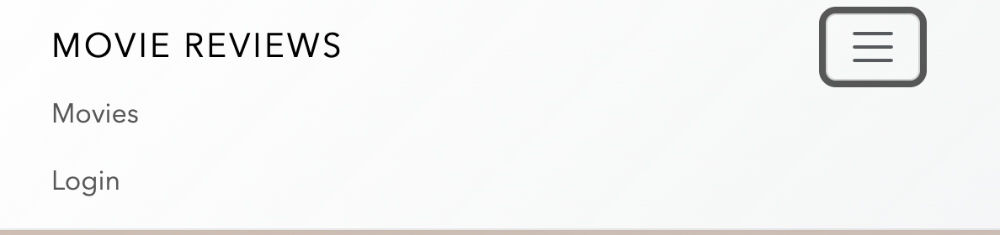

### 2.3 Quản lý trạng thái đăng nhập bằng React state

**Thực hiện:**

- Khai báo state `user` trong `App.js` bằng `React.useState`.
- Tạo hai hàm `login()` và `logout()` để thay đổi trạng thái đăng nhập.
- Lưu trạng thái người dùng vào `localStorage` để giữ session giả lập khi tải lại trang.

**Mã chính:**

```javascript
const [user, setUser] = React.useState(getInitialUser);

async function login(nextUser = null) {
  setUser(nextUser);
}

async function logout() {
  setUser(null);
}
```

**Kết quả:**

- Frontend mô phỏng được trạng thái đăng nhập theo đúng yêu cầu lab.
- Sau khi đăng nhập, người dùng có thể thêm, sửa và xóa review của chính mình.

**Ảnh minh họa:**


### 2.4 Hoàn thiện các màn hình chức năng của frontend

**Thực hiện:**

- Với `movies-list`:
- Gọi `GET /api/v1/movies`.
- Tìm kiếm theo tên phim.
- Lọc theo `rated`.
- Phân trang cơ bản.
- Với `movie`:
- Gọi `GET /api/v1/movies/id/:id`.
- Hiển thị thông tin phim và danh sách review.
- Cho phép xóa hoặc chuyển sang chỉnh sửa review nếu đúng người dùng đã đăng nhập.
- Với `add-review`:
- Gọi `POST /api/v1/movies/review` để thêm review.
- Gọi `PUT /api/v1/movies/review` để cập nhật review.
- Với `login`:
- Nhập `name` và `id` để mô phỏng đăng nhập.

**Kết quả:**

- Frontend không chỉ đáp ứng phần navbar và routing, mà còn kết nối thực tế với backend để thao tác dữ liệu review.

**Ảnh minh họa:**

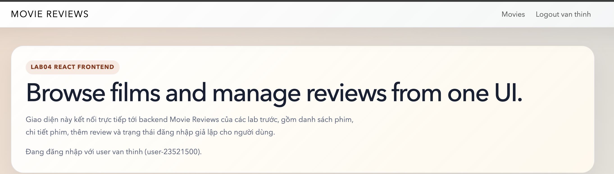

<!-- lọc phim theo rating -->


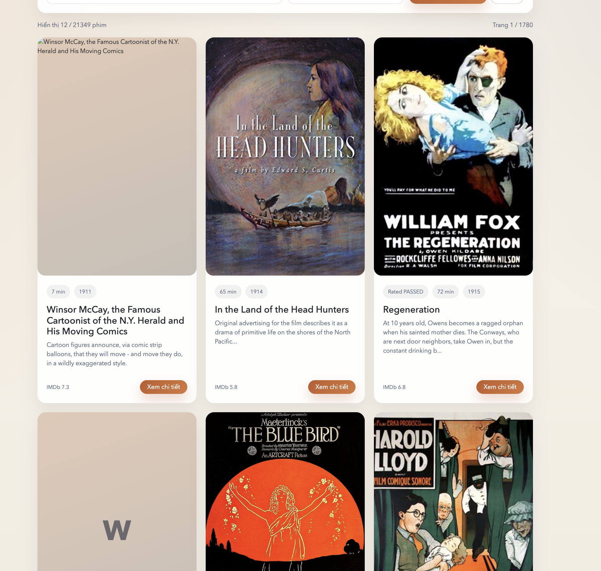


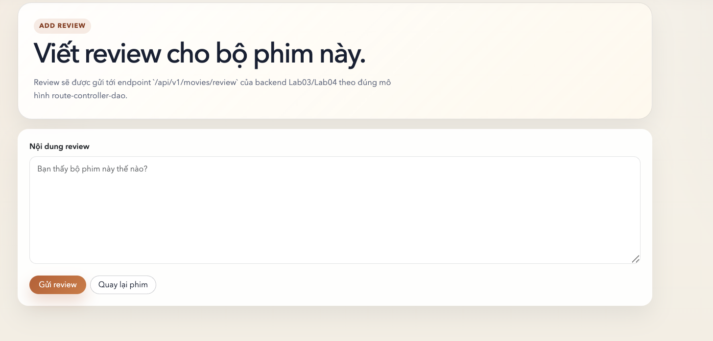

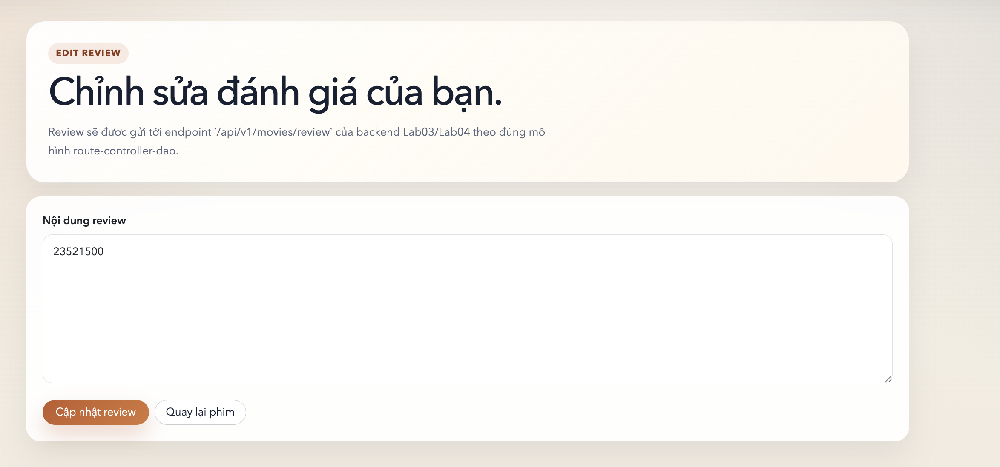

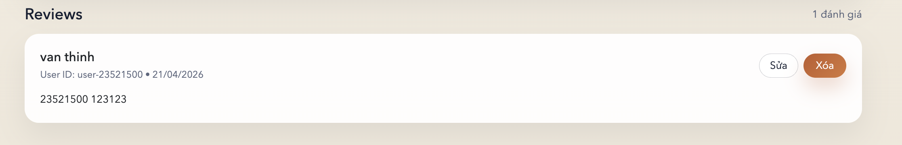

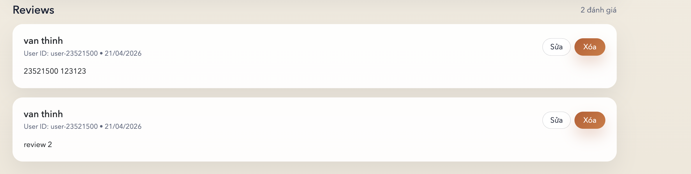

## Bài 3: Thiết lập các định tuyến cho các component

### 3.1 Cấu hình `BrowserRouter` và `Routes`

**Thực hiện:**

- Bọc ứng dụng bằng `BrowserRouter` trong `src/index.js`.
- Khai báo các `Route` trong `App.js`.

**Kết quả:**

- Ứng dụng có thể điều hướng giữa các trang mà không cần tải lại toàn bộ website.

**Ảnh minh họa:**

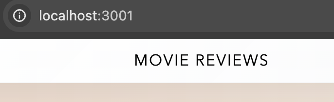

### 3.2 Thiết lập các route theo yêu cầu đề bài

**Thực hiện:**

```javascript
<Routes>
  <Route path="/" element={<MoviesList user={user} />} />
  <Route path="/movies" element={<MoviesList user={user} />} />
  <Route path="/movies/:id/review" element={<AddReview user={user} />} />
  <Route path="/movies/:id" element={<Movie user={user} />} />
  <Route path="/login" element={<Login login={login} user={user} />} />
</Routes>
```

**Kết quả:**

- `/` và `/movies` hiển thị danh sách phim.
- `/movies/:id` hiển thị trang chi tiết phim.
- `/movies/:id/review` hiển thị form thêm hoặc sửa review.
- `/login` hiển thị trang đăng nhập giả lập.

**Ảnh minh họa:**

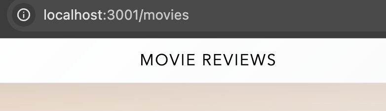

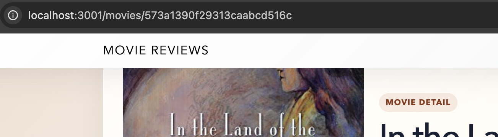

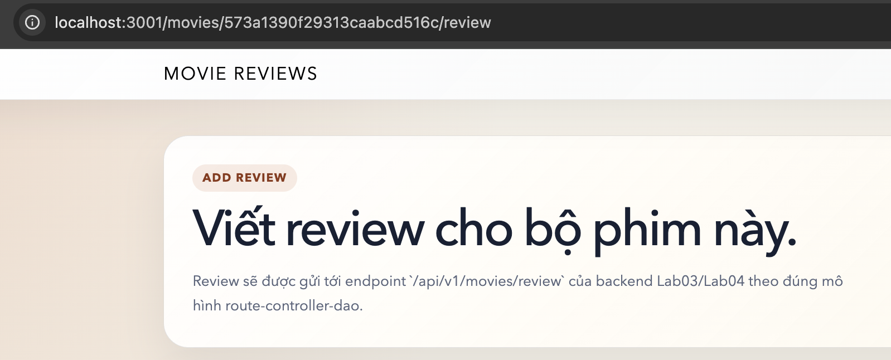

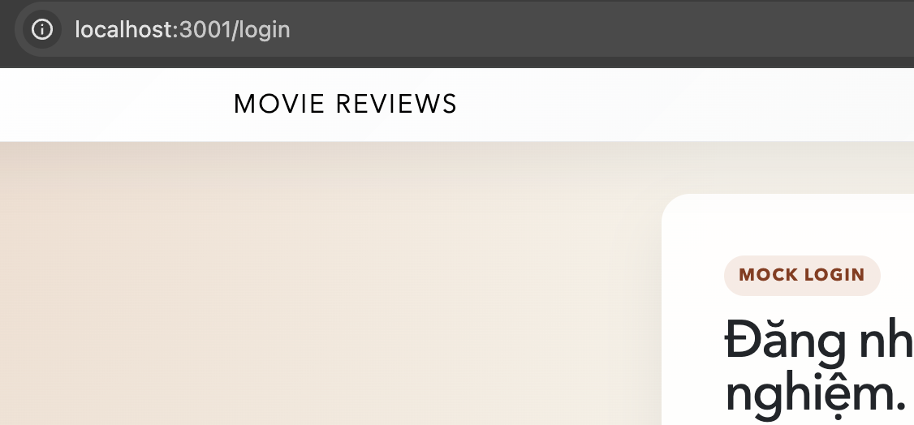

## 7. Ghi chú triển khai

- Backend trong `Lab04/movie-reviews/backend` được kế thừa từ bài trước để giữ nguyên API `movies`, `ratings`, `movie by id` và CRUD `review`.
- Frontend được viết bằng React 18, dùng `react-router-dom` v6 và `react-bootstrap`.
- Giao diện có thêm một số phần mở rộng so với yêu cầu tối thiểu của đề:
- lưu user bằng `localStorage`
- tìm kiếm phim theo tên
- lọc phim theo rating
- phân trang danh sách phim
- hiển thị, cập nhật và xóa review ngay trên giao diện
