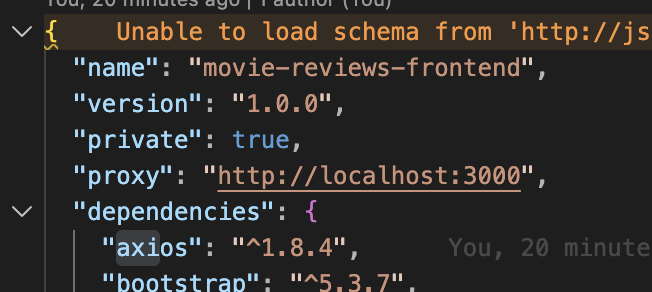
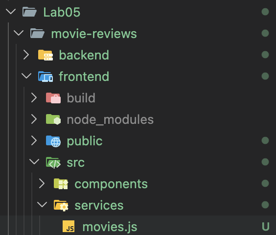
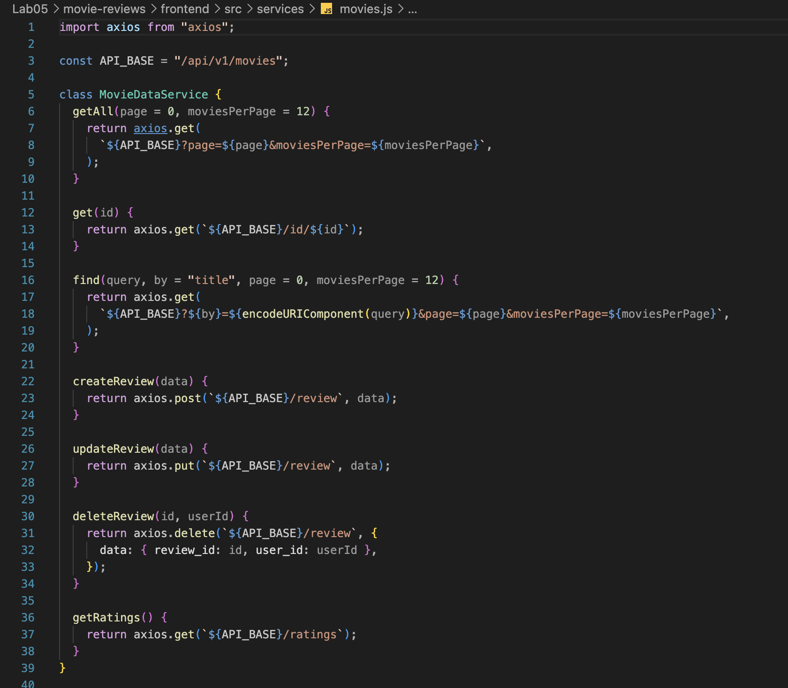
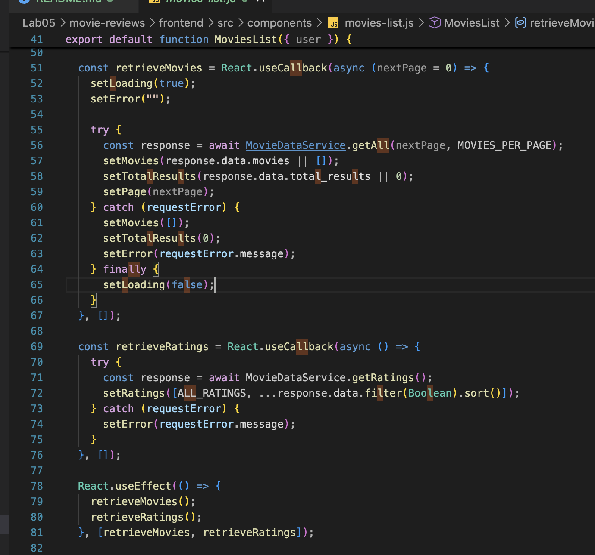
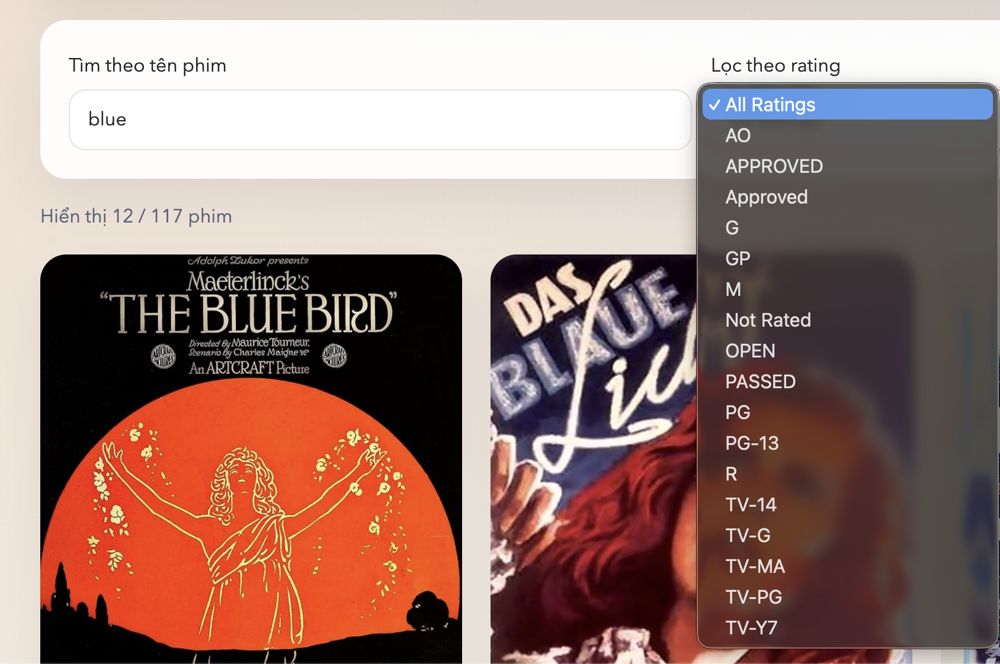
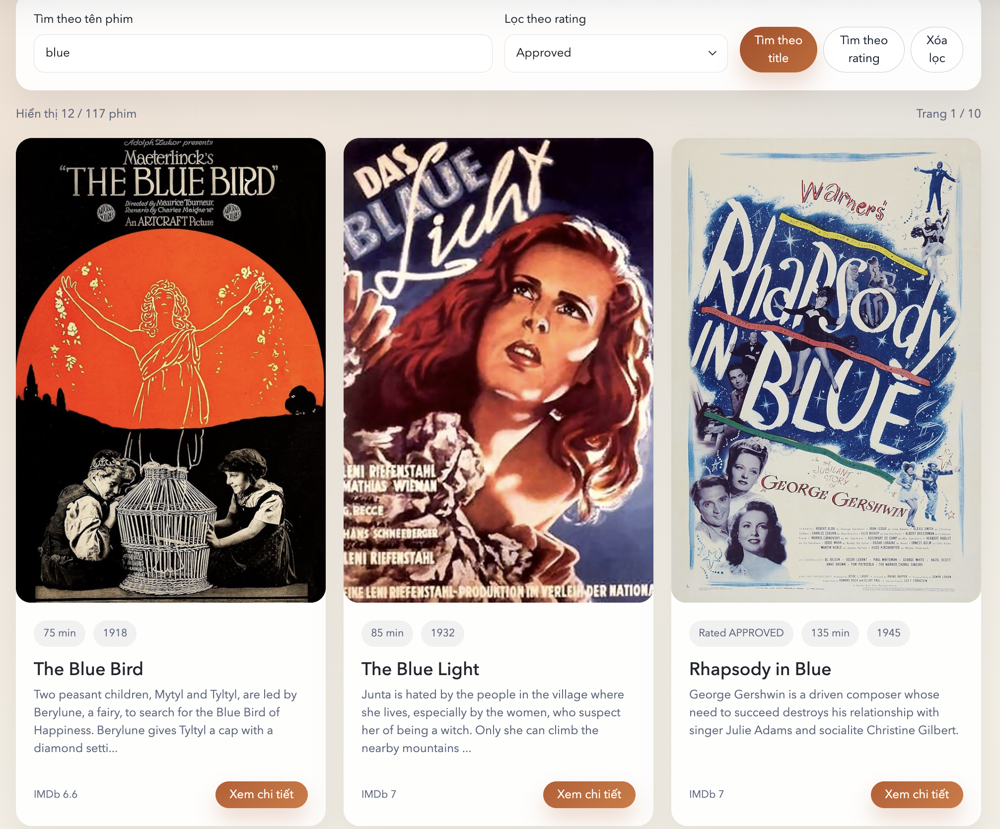
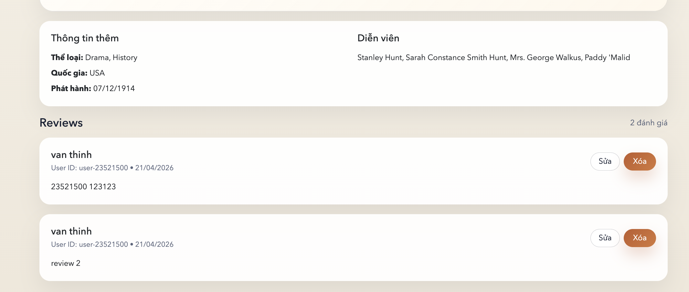
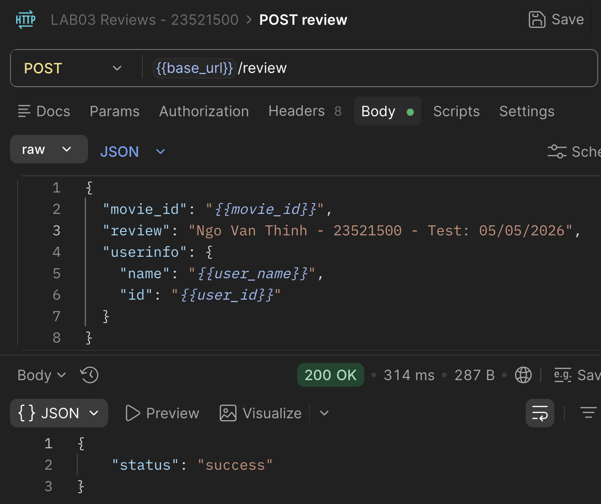

# Lab05 (Xây dựng Frontend với ReactJS)

## 1. Thông tin sinh viên

| Họ tên                   | MSSV               | Lớp                |
| :------------------------- | :----------------- | :------------------ |
| **Ngô Văn Thịnh** | **23521500** | **IE213.Q21** |

## 2. Thông tin môn học

- Môn học: **IE213.Q21 - Kỹ thuật phát triển hệ thống web**

## 3. Danh sách lab

- **Lab05: Xây dựng Frontend với ReactJS**

## 4. Mô tả ngắn gọn Lab05

Lab05 kế thừa backend và frontend từ các bài trước, tập trung chuẩn hóa việc kết nối từ frontend tới backend bằng **axios**, tổ chức lớp dịch vụ `MovieDataService`, xây dựng form tìm kiếm movie theo `title` và `rating`, hiển thị danh sách movie bằng `Card` của React-Bootstrap, hiển thị trang chi tiết movie cùng danh sách review, và định dạng thời gian review bằng `momentjs`.

## 5. Cách chạy chương trình

1. Chạy backend:

```bash
cd Lab05/movie-reviews/backend
npm install
cp .env.example .env
```

2. Cấu hình `.env`:

```env
MOVIEREVIEWS_DB_URI=<mongodb-atlas-uri>
MOVIEREVIEWS_NS=sample_mflix
PORT=3000
```

3. Khởi động backend:

```bash
npm run dev
```

4. Chạy frontend ở terminal khác:

```bash
cd Lab05/movie-reviews/frontend
npm install
npm start
```

5. Mở trình duyệt:

- Frontend: `http://localhost:3001` hoặc cổng React thông báo khi chạy
- Backend API: `http://localhost:3000/api/v1/movies`

## 6. Chi tiết thực hiện theo từng câu

## Bài 1: Kết nối tới Backend

### 1.1 Cài đặt axios cho dự án hiện tại

**Thực hiện:**

```bash
npm install axios moment
```

**Kết quả:**

- Frontend có thêm `axios` để gọi API backend.
- Frontend có thêm `moment` để định dạng ngày tháng review.

**Ảnh minh họa:**



### 1.2 Tạo lớp dịch vụ `MovieDataService`

**Thực hiện:**

- Tạo file `src/services/movies.js`.
- Khai báo class `MovieDataService`.
- Export một instance dùng chung cho toàn bộ component.

**Kết quả:**

- Toàn bộ lời gọi API được gom về một nơi, dễ tái sử dụng và đúng yêu cầu Lab05.

**Mã chính:**

```javascript
import axios from "axios";

const API_BASE = "/api/v1/movies";

class MovieDataService {
  getAll(page = 0, moviesPerPage = 12) {
    return axios.get(
      `${API_BASE}?page=${page}&moviesPerPage=${moviesPerPage}`,
    );
  }
}
```

**Ảnh minh họa:**



### 1.3 Tạo các lời gọi dịch vụ tới backend

**Thực hiện:**

- Cài các hàm:
- `getAll()`
- `get()`
- `find()`
- `createReview()`
- `updateReview()`
- `deleteReview()`
- `getRatings()`

**Mã chính:**

```javascript
class MovieDataService {
  getAll(page = 0, moviesPerPage = 12) { ... }
  get(id) { ... }
  find(query, by = "title", page = 0, moviesPerPage = 12) { ... }
  createReview(data) { ... }
  updateReview(data) { ... }
  deleteReview(id, userId) { ... }
  getRatings() { ... }
}
```

**Kết quả:**

- Frontend gọi đúng các endpoint đã xây dựng từ backend của các lab trước.

**Ảnh minh họa:**



## Bài 2: Xây dựng MoviesList Component

### 2.1 Tạo các biến trạng thái

**Thực hiện:**

- Dùng `useState()` để tạo:
- `movies`
- `ratings`
- `searchTitle`
- `searchRating`
- `page`
- `totalResults`

**Kết quả:**

- Component có đủ state để quản lý dữ liệu movie, ratings và tìm kiếm.

**Mã chính:**

```javascript
const [movies, setMovies] = React.useState([]);
const [ratings, setRatings] = React.useState([ALL_RATINGS]);
const [searchTitle, setSearchTitle] = React.useState("");
const [searchRating, setSearchRating] = React.useState(ALL_RATINGS);
const [page, setPage] = React.useState(0);
const [totalResults, setTotalResults] = React.useState(0);
```

### 2.2 Tạo `retrieveMovies()` và `retrieveRatings()`

**Thực hiện:**

- Tạo `retrieveMovies()` để lấy danh sách movie.
- Tạo `retrieveRatings()` để lấy danh sách ratings.
- Dùng `useEffect()` gọi hai hàm khi component render lần đầu.

**Kết quả:**

- Khi mở trang, danh sách phim và ratings được tải tự động từ backend.

**Mã chính:**

```javascript
React.useEffect(() => {
  retrieveMovies();
  retrieveRatings();
}, [retrieveMovies, retrieveRatings]);
```

**Ảnh minh họa:**



### 2.3 Tạo 2 search form theo title và rating

**Thực hiện:**

- Tạo form nhập `title`.
- Tạo select box cho `rating`.
- Hiện thực:
- `findByTitle()`
- `findByRating()`

**Kết quả:**

- Người dùng có thể tìm movie theo tên hoặc lọc theo rating ngay trên frontend.

**Mã chính:**

```javascript
function findByTitle(event) {
  event.preventDefault();
  if (!searchTitle.trim()) {
    retrieveMovies(0);
    return;
  }
  find(searchTitle.trim(), "title");
}

function findByRating() {
  if (searchRating === ALL_RATINGS) {
    retrieveMovies(0);
    return;
  }
  find(searchRating, "rated");
}
```

**Ảnh minh họa:**



### 2.4 Hiển thị các movie bằng `Card`

**Thực hiện:**

- Dùng `Card`, `Row`, `Col` của React-Bootstrap để render danh sách movie.
- Mỗi movie hiển thị poster, title, rating, plot rút gọn và nút xem chi tiết.

**Kết quả:**

- MoviesList hiển thị rõ ràng, có tính trực quan và đúng mục tiêu bài thực hành.

**Mã chính:**

```javascript
<Row className="g-4">
  {movies.map((movie) => (
    <Col lg={4} md={6} key={movie._id}>
      <Card className="movie-card border-0 h-100 overflow-hidden">
        ...
      </Card>
    </Col>
  ))}
</Row>
```

**Ảnh minh họa:**


### 2.5 Hiện thực tìm phim theo `Title` hoặc `Rating`

**Thực hiện:**

- Viết hàm `find(query, by)`.
- Gọi `MovieDataService.find()` để lấy dữ liệu từ backend.

**Kết quả:**

- Movie list cập nhật đúng theo điều kiện tìm kiếm.

**Ảnh minh họa:**

- Title:



- Rating:
  

## Bài 3: Hiển thị thông tin trang Movie

### 3.1 Tạo state `movie`

**Thực hiện:**

- Tạo biến trạng thái `movie` để lưu:
- `_id`
- `title`
- `rated`
- `plot`
- `reviews`

**Kết quả:**

- Component `movie.js` có đủ dữ liệu để hiển thị chi tiết phim.

**Mã chính:**

```javascript
const [movie, setMovie] = React.useState(null);
const [loading, setLoading] = React.useState(true);
const [error, setError] = React.useState("");
```

### 3.2 Xây dựng `getMovie()`

**Thực hiện:**

- Gọi `MovieDataService.get(id)` từ component Movie.
- Dùng `useParams()` để lấy id từ route.
- Dùng `useEffect()` để gọi lại khi id thay đổi.

**Kết quả:**

- Trang movie lấy đúng dữ liệu chi tiết của phim được chọn.

**Mã chính:**

```javascript
const loadMovie = React.useCallback(async () => {
  const response = await MovieDataService.get(id);
  setMovie(response.data);
}, [id]);

React.useEffect(() => {
  loadMovie();
}, [loadMovie]);
```

### 3.3 Trang trí JSX cho trang chi tiết movie

**Thực hiện:**

- Hiển thị poster, tiêu đề, plot, rating, năm, diễn viên và các thông tin liên quan.
- Thêm nút quay lại danh sách và thêm review.

**Kết quả:**

- Người dùng có thể xem chi tiết movie trên một trang riêng, dễ theo dõi hơn danh sách tổng quát.

**Mã chính:**

```javascript
<Row className="g-4 align-items-center">
  <Col lg={4}>
    <Poster movie={movie} />
  </Col>
  <Col lg={8}>
    <h1 className="page-title">{movie.title}</h1>
    <p className="page-subtitle">{movie.plot}</p>
  </Col>
</Row>
```

**Ảnh minh họa:**


## Bài 4: Hiển thị danh sách review

### 4.1 Hiển thị review tương ứng cho từng phim

**Thực hiện:**

- Render `movie.reviews` phía dưới phần plot.
- Hiển thị tên người review, user id, ngày review và nội dung review.

**Kết quả:**

- Mỗi movie hiển thị được danh sách review liên quan từ backend.

**Mã chính:**

```javascript
{movie.reviews?.map((review) => (
  <Card key={review._id} className="review-card border-0">
    <Card.Body className="p-4">
      <h3>{review.name}</h3>
      <p>{review.text}</p>
    </Card.Body>
  </Card>
))}
```

**Ảnh minh họa:**



### 4.2 Thêm review

**Thực hiện:**

- Tạo component `add-review.js` để nhập nội dung review.
- Dùng `MovieDataService.createReview()` để gửi dữ liệu lên backend.
- Lấy `movie_id` từ route và `userinfo` từ trạng thái đăng nhập của người dùng.
- Sau khi thêm thành công, điều hướng người dùng quay lại trang chi tiết movie.

**Mã chính:**

```javascript
async function saveReview(event) {
  event.preventDefault();

  await MovieDataService.createReview({
    movie_id: id,
    review: review.trim(),
    userinfo: {
      name: user.name,
      id: user.id,
    },
  });

  navigate(`/movies/${id}`);
}
```

**Kết quả:**

- Người dùng có thể thêm review mới cho movie trực tiếp từ frontend.

**Ảnh minh họa:**



### 4.3 Điều chỉnh cách hiển thị giờ với `momentjs`

**Thực hiện:**

- Dùng `moment()` trong component Movie để format ngày review.

**Mã chính:**

```javascript
const formatted = moment(value);
return formatted.isValid()
  ? formatted.format("DD/MM/YYYY")
  : "Không rõ thời gian";
```

**Kết quả:**

- Ngày review hiển thị rõ ràng và thống nhất hơn so với dạng raw date từ MongoDB.

**Ảnh minh họa:**


## 7. Ghi chú triển khai

- Lab05 được kế thừa từ Lab04 để tận dụng toàn bộ backend Movie Reviews đã ổn định.
- Điểm thay đổi chính của Lab05 là chuẩn hóa tầng gọi API bằng `axios`.
- Chức năng thêm, sửa, xóa review vẫn hoạt động từ frontend như các lab trước.
- MoviesList hỗ trợ đồng thời tìm theo `title`, lọc theo `rating` và phân trang cơ bản.
